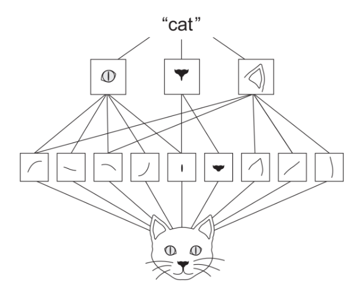
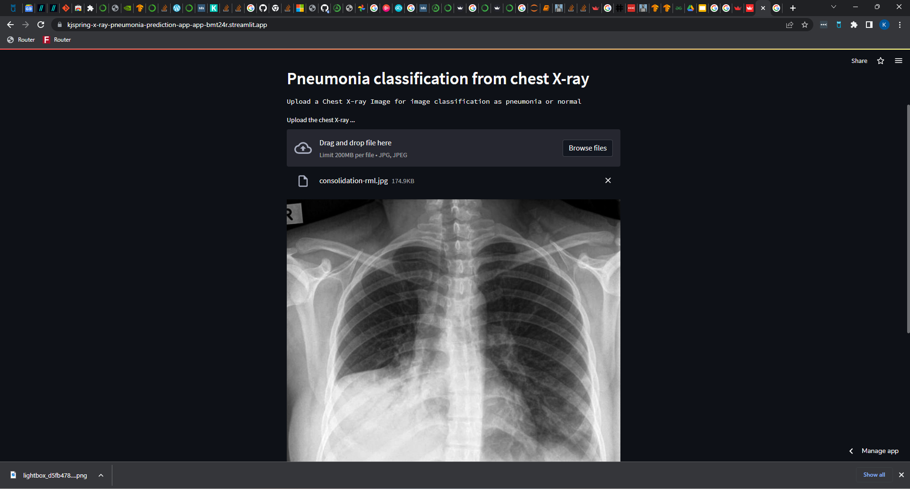

# Background
In the United States, pneumonia is the second only to the birth of a child, for the most likely reason a person is admitted to a hospital. In the U.S. over 1 million adults will be admitted for pneumonia and complications each year and 50,000 will die ([source](https://www.reuters.com/article/health-pneumonia/study-can-pneumonia-be-reliably-diagnosed-without-x-rays-idINL4N0AY04820130129)). According to UNICEF, every year on our planet 700,000 children under the age of 5 will die from complications of pneumonia. 

Symptoms of pneumonia can appear suddently. A mild case may present with limited shortness of breath and productive cough. Severe disease may include fever, respiratory distress, and sepsis. Pneumonia is caused by inflamation around the air sacs of lungs which will keep an inflicted person's lungs from getting enough oxygen into their blood. These air sacs may be filled with fluid or pus. Infections of fungi, viruses, or bacteria, or irritation from environmental factors may lead to pneumonia.

Early detection of pneumonia is critical for positive health outcomes and decreased cost of care. If caught early, pneumonia can be treated as a mild case and the patient can recover at home. Severe cases will need to be treated in the hopital and potentially the intensive care unit. The National Health Service in the United Kingdom found it cost US equivaqlent $4,718 to treat a patient with pneumonia ([source](https://www.tandfonline.com/doi/full/10.1080/13696998.2022.2090734)). According to guidelines by the American Thoracic Society and Infectious Disease Society of America, x-ray identification of the presence of infiltrates (white spots) in the lungs of a patient with history of symptoms is the gold standard for diagnosis of pneumonia.

It may take the radiologist a few minutes to identify pneumonia with their domain knowledge but the reading could be delayed due to the number of other radiological images a radiologist needs to read and diagnose. The Association of American Medical Colleges (AAMC) projects to have a serious shortage of radiologists by 2033. This is in contrast of the increase in medical imaging of about 5% a year. A shortage of radiologists will lead to worse patient outcomes as the turnaround time for them to make a diagnosis on a medical image increases.

## Business Problem

Our company, United Healthcare, is an medical insurance company that provides health insurance through private and Affordable Care Act (ACA) health insurance exchanges. We are expanding our coverage to more rural clients and hospitals but this is where the shortage of specialty care such as radiology is in crisis. Reducing this bottleneck in pneumonia diagnosis will reduce the time a patient is admitted to the hospital and reduce costs associated with this care.

With the increase cost and lower supply of radiologists, United Healthcare needs to **develop an application to classify chest x-ray images with pneumonia or without (normal)**. Those predicted to have pneumonia would be forwarded to a radiologist for a confirmed diagnosis. This will lessen the burden and cost of radiologists reviewing chest x-rays that are not indicative of pneumonia.

## Stakeholders
- United Healthcare executives
- Healthcare workers

## Repository Navigation
* [/data](/data) Folder where data is to be downloaded
* [/img](/img) Image files for notebook and Pneumonia Classification App testing
* [/plots](/plots) Saved plots from jupyter notebook

## Data

To find a solution to this business problem we need labeled chest x-ray images. There is a freely available dataset found on [Kaggle](https://www.kaggle.com/datasets/paultimothymooney/chest-xray-pneumonia). It was originally collected by [Kermany et al](https://www.cell.com/cell/fulltext/S0092-8674(18)30154-5). There are a total of 1583 normal images and 4273 pneumonia images. This is a significant imbalance. Weights were put on the classes to account for this imbalance. In this way more weight will be given to the normal images and less to the pneumonia images to make them balanced.

In the Kaggle repository there are 5,863 x-ray images in JPEG format. They are stored in directories labeled 'val', 'test', and 'train'. Within each of those directories the images are in folders 'PNEUMONIA' or 'NORMAL'.

The data found in the `NORMAL` and `PNEUMONIA` folders were compiled together separately. These were then split into training and testing data using the python library [`python_splitter`](https://github.com/bharatadk/python_splitter). A compressed version of this cleaned data is available to download and is what you should use to reproduce this work [Amazon S3](https://flatiron-phase4-xray.s3.amazonaws.com/Train_Test_Folder.zip). 

The folder structure in `Train_Test_Folder` is:
* test
	* NORMAL
	* PNEUMONIA
* train
	* NORMAL
	* PNEUMONIA

The data in the `train` folder was further divided into training (80%) and validation (20%) using `tensorflow.keras.utils.image_dataset_from_directory`. Colormode was set to `grayscale`, image height was set to 240, and image width converted to 240. The data in the `test` folder was used for the testing data and similarily processed as the training.

## Models
Convolutional Neural Networks (CNN) are a machine learning technique that reduces that can be used to classify images. CNNs have outperformed other machine learning algorithms in image classification.

While densly connected neural networks learn global patterns in ther input feature space, convolution layers learn local paterns, that are found in 2-dimensional windows. This allows CNNs to learn patterns that are translation-invariant, something learned in one part of the image can be reused in another part. CNNs can also learn spatial heirarchies of patterns. The first layer of a CNN learns small local patterns such as edges. The next layer will learn larger patterns.

Five models were developed from a simple single layer baseline model to a model that uses a 19-layer CNN that was pretrained on one million images.

## Model Results

For our business problem we need to be careful about false negatives. These are images the model would predict as being normal when the patient has pneumonia. False negatives must be kept low because patients with x-rays classified as normal will not have a second look by a licensed medical profession to confirm pneumonia. Accuracy also needs to be high as the model would not be useful if the model is not accurate at detecting a normal x-ray from an x-ray with signs of pneumonia. I would like both accuracy and specificity to be above 90%, while false negative rate (FNR) should be below 5%.

According to my criteria, the best model was model 1, the baseline model. This is because it has the highest accuracy and the lowest false negative rate.

### Model 1 confusion matrix on testing data

## Pneumonia Classification App

The Pneumonia Classification App is designed to be used by health professionals to quickly identify patients that may have pneumonia. This will pre-screen the patients before the x-ray is sent to a radiologist. The radiologist would then classify the images as having pneumonia or not. This data would be saved to further train future models as the application is updated.

This [pneumonia classification app](https://kjspring-x-ray-pneumonia-prediction-app-app-bmt24r.streamlit.app/) is a prototype to allow stakeholders and other interested parties to test the pneumonia classification model on their own. Go to the [website](https://kjspring-x-ray-pneumonia-prediction-app-app-bmt24r.streamlit.app/) and upload your chest x-ray image. The model will classify the x-ray as normal or pneumonia.

## Conclusions

The five models built for this analysis all did very well in accuracy, specificity, recall, and false negative rate (FNR). Accuracy is the ability to correctly predict pneumonia and normal cases out of all the classifications. Recall is the ability for a model to accuratly classify the positive case (pneumonia). Specificity is the probability that an actual normal x-ray will be classified as normal.

The best model according to validation and testing metrics is model 1. It had the highest values for accuracy, specificity, recall, and false negative rate. This is a simple convolutional neural network that has one layer convolutional layer and max pooling layer. The decay in the evaluation metrics from a simple CNN to more comlex ones was suprising. The reason this did better versus the other more complex models may be due to the limited amount of images in the dataset. As more layers are added to the model the more complexity and detail that the neural network would be able to process. The higher amount of connections between the layers may result in more innacurate information and overfitting.

Althought model 5 had the worse testing metrics compared to the other models, my small test with the prediction function indicates that model 5 with images downloaded from Google Image Search may be the best choice for use in the Pneumonia Classification Application. This is because it was able to correctly classify these images while model 1 classified both the normal and pneumonia images as pneumonia. It would be beneficial to do A/B testing to compare model 5 with model 1 in beta testing of the Pneumonia Classification Application. Doing this we can determine which model is better and improve that model by including this new data in subsequent training data.

## Recommendatons
* Deploy the Pneumonia Classificaiton Application with our healthcare partners
* Use A/B testing with model 1 and 5 in beta testing of Pneumonia Classification App
* Allow application users to leave feedback on the actual diagnosis of the patient
* Accumulate this extra data to improve the classification model

## Links
* [Pneumonia Classification App](https://kjspring-x-ray-pneumonia-prediction-app-app-bmt24r.streamlit.app)
* [Pneumonia Classification App Code Repository](https://github.com/kjspring/x-ray-pneumonia-prediction-app)